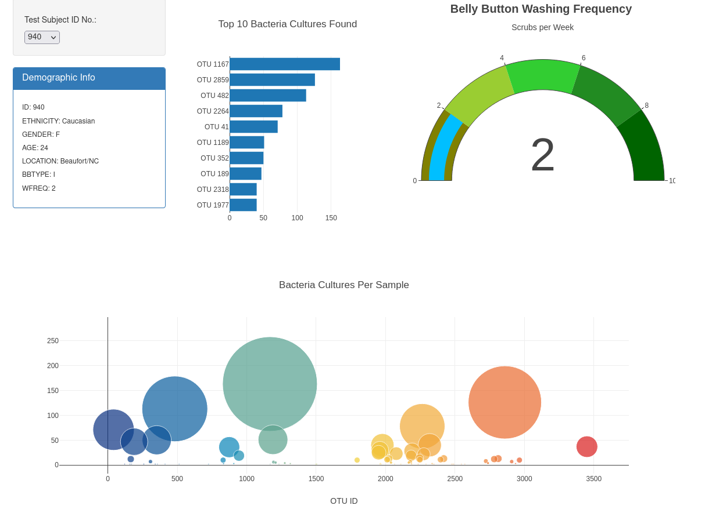

# Bellybutton Bugs

## Overview

This web app is an interactive dashboard for viewing data about the diversity of bellybutton bacteria collected from test subjects. The information is selected by Test Subject ID, and is visualized with three charts. There is a bar chart to show the bacteria with the top ten sample sizes, a gauge chart to show washing frequency, and a bubble chart to show relative sample size of all bacteria found. 

## How it Works

To get the functionality and interactivity we needed out of this dashboard we used javascript to create the app. The charts are created using Plotly.js and the sample data is contained in a JSON file. The web app layout is created using Bootstrap 3.3. 

## Going Forward

Future improvements to the web app would be to visualize aggregated data, grouped by demographic details. Migrating the code to Plotly with Dash would also be helpful.
